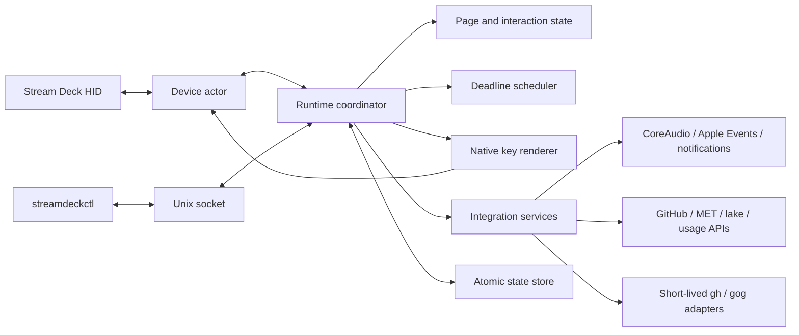

# streamdeckd Implementation Plan

**Status:** Proposed  
**Date:** 2026-07-24  
**Target:** macOS and the existing 5×3 Stream Deck MK.2  
**Source of truth:** The current Command Center profile and TypeScript services, read-only  

## 1. Executive decision

Build `streamdeckd` as a purpose-built, headless macOS daemon for this specific Stream Deck setup.

The daemon will:

- own the Stream Deck HID device directly;
- render all key images with Rust-native libraries;
- implement the six existing pages and their interactions;
- run all persistent state, scheduling, caching, and integration logic in one process;
- use short-lived command adapters where they reduce migration risk;
- expose a small local CLI for status, testing, and configuration reload;
- remain independent of Elgato Stream Deck and OpenDeck configuration.

The daemon will not implement the Stream Deck plugin SDK, third-party plugin loading, a WebKit-based editor, or a plugin marketplace. Those features would recreate most of the resource cost and complexity this project is intended to eliminate.

### Measured baseline and target

| Runtime | Resident memory | Processes | Observed idle CPU |
|---|---:|---:|---:|
| Elgato Stream Deck with the current profile | approximately 1,232 MB | 13 | below 1% |
| OpenDeck with copied plugins | approximately 501 MB | 7 | below 1% |
| `streamdeckd` target | below 80 MiB | 1 persistent process | below 0.5% averaged over 10 minutes |

The memory target includes the daemon, its renderer, caches, and normal Home-page integrations. Short-lived `gh`, `gog`, and AppleScript processes are permitted during explicit refreshes but must not remain resident.

## 2. Goals

### 2.1 Functional goals

1. Preserve the current six-page behavior:
   - Home
   - Mixer
   - GitHub
   - Spotify
   - Stensjön
   - Pomodoro
2. Preserve the current layout, including intentionally blank keys and both meeting tiles.
3. Preserve short-press and long-press semantics, including visible feedback when the long-press threshold is reached.
4. Preserve persistent Pomodoro state, statistics, completion acknowledgement, sounds, and Mac alerts.
5. Preserve current API behavior, cache lifetimes, stale-data behavior, and error states unless the plan explicitly improves them.
6. Keep the configuration and non-secret state easy to back up and version in Git.
7. Provide a safe fallback to the existing Elgato configuration.

### 2.2 Resource and reliability goals

1. Maintain one persistent process in the normal idle state.
2. Perform no polling for keys or integrations that are not visible and do not affect an active timer.
3. Never rerender or resend an unchanged key image.
4. Avoid permanent helper processes and prevent orphaned children on shutdown.
5. Recover cleanly from sleep, wake, USB disconnects, API failures, and daemon restarts.
6. Preserve the active timer and its deadline across daemon restarts and system sleep.
7. Bound all network calls and subprocesses with timeouts.

### 2.3 Maintainability goals

1. Separate device I/O, domain state, integrations, rendering, and macOS adapters behind narrow interfaces.
2. Make every page and key declarative rather than embedding coordinate checks throughout the code.
3. Make integration parsing and domain transitions testable without hardware or network access.
4. Use golden-image tests for the 72×72 key renderer.
5. Keep secrets out of the repository and human-readable configuration.

## 3. Non-goals

- General Stream Deck plugin compatibility.
- Loading `.sdPlugin` bundles.
- A drag-and-drop graphical profile editor.
- Windows or Linux support in the first version.
- Support for every Stream Deck model.
- Cloud-hosted state or telemetry.
- Reusing encrypted Elgato plugin assets or redistributing proprietary assets.
- Modifying or deleting the current Elgato profile.
- Automatically stopping Elgato Stream Deck without an explicit command.

## 4. Product behavior to preserve

Coordinates below are one-based and shown as `row,column`.

### 4.1 Home

| Position | Tile | Press behavior |
|---|---|---|
| 1,1 | Mixer summary | Open Mixer |
| 1,2 | Claude combined projection | Force refresh |
| 1,3 | Codex usage | Force refresh |
| 1,4 | Claude five-hour usage | Force refresh |
| 1,5 | Claude seven-day usage | Force refresh |
| 2,1 | Spotify glance | Short press toggles playback; long press opens Spotify page |
| 2,2 | GitHub summary | Open GitHub |
| 2,3 | Pomodoro glance | Short press starts/pauses; long press opens Pomodoro |
| 2,4 | Next meeting | Focus an existing Meet window or open the Meet PWA |
| 2,5 | Following meeting | Focus an existing Meet window or open the Meet PWA |
| 3,1 | Blank | No action |
| 3,2 | Blank | No action |
| 3,3 | Current Stensjön weather | Refresh/open weather detail only if later requested |
| 3,4 | Tomorrow forecast | Refresh/open weather detail only if later requested |
| 3,5 | Stensjön water temperature | Show the temporary history panel |

Meeting tiles show the meeting title and start time. For meetings on the current day, they also show a useful countdown or elapsed status such as `in 42m`, `in 2h`, or `now`.

### 4.2 Mixer

| Position | Action |
|---|---|
| 1,1 | Home |
| 1,2 | Select MacBook Pro Speakers |
| 1,3 | Select Bose NC 700 Headphones output |
| 1,4 | Select the first unambiguous USB output matching `usb` |
| 1,5 | Toggle output mute |
| 2,1 | Output volume −10 |
| 2,2 | Output volume +10 |
| 2,3 | Select MacBook Pro Microphone |
| 2,4 | Select Bose NC 700 Headphones input |
| 2,5 | Select the first unambiguous input matching `røde|rode` |
| 3,1 | Toggle microphone mute |
| 3,2 | Input gain −10 |
| 3,3 | Input gain +10 |
| 3,4 | Blank |
| 3,5 | Current mixer summary |

Unavailable devices must remain visible but clearly disabled. Ambiguous regular-expression matches must not select a device.

### 4.3 GitHub

| Position | Action |
|---|---|
| 1,1 | Home |
| 1,2 | Review requests |
| 1,3 | Authored pull requests |
| 1,4 | Assigned issues |
| 1,5 | Notification inbox |
| 2,1–2,5 | Five most recently updated authored pull requests |
| 3,1 | Force refresh |
| Remaining keys | Blank |

Metric keys open their corresponding GitHub filter. Item keys open the item URL. The inbox tile must indicate when the API result is capped at 100.

### 4.4 Spotify

| Position | Action |
|---|---|
| 1,1 | Home |
| 1,2 | Previous track |
| 1,3 | Play/pause with artwork and playback state |
| 1,4 | Next track |
| 1,5 | Open or focus Spotify |
| 2,1 | Spotify volume −5 |
| 2,2 | Spotify volume +5 |
| 2,3 | Toggle shuffle |
| 2,4 | Toggle repeat |
| Remaining keys | Blank |

Spotify status polling runs only while the Home Spotify glance or Spotify page is visible. Album artwork is cached by track identity and bounded by a small least-recently-used cache.

### 4.5 Stensjön

| Position | Action |
|---|---|
| 1,1 | Home |
| 1,2 | Current water temperature |
| 1,3 | Seven-day trend summary |
| 1,4 | Blank |
| 1,5 | Temporary-panel countdown/status |
| 2,1–2,5 | Historical days 1–5 |
| 3,1–3,2 | Historical days 6–7 |
| Remaining keys | Blank |

Pressing the Home water-temperature tile presents this page as a temporary panel. The panel automatically returns to Home after a configurable interval, initially 10 seconds. Any interaction with the panel restarts that timeout; pressing Home dismisses it immediately.

### 4.6 Pomodoro

| Position | Action |
|---|---|
| 1,1 | Home |
| 1,2 | Timer/status |
| 1,3 | Start/pause |
| 1,4 | Skip current phase |
| 1,5 | Reset current session |
| 2,1 | Start focus |
| 2,2 | Start short break |
| 2,3 | Start long break |
| 2,4 | Cycle progress |
| 2,5 | Break statistics |
| 3,1 | Adjust focus duration by 5 minutes |
| 3,2 | Adjust short break by 1 minute |
| 3,3 | Adjust long break by 5 minutes |
| 3,4 | Today’s focus statistics |
| 3,5 | All-time focus statistics |

Duration controls wrap at their bounds:

- focus: 5–90 minutes;
- short break: 1–30 minutes;
- long break: 5–60 minutes.

A completion remains pending until acknowledged from the deck or the Mac. Starting a new phase, skipping, or explicitly dismissing the alert counts as acknowledgement.

## 5. Proposed architecture



### 5.1 Process model

The normal runtime consists of one process, `streamdeckd`. It owns:

- a Tokio runtime;
- one device actor;
- one runtime coordinator;
- an immutable asset registry;
- shared service caches;
- a deadline scheduler;
- a local Unix-domain control socket;
- structured logging.

The daemon must reap every child it starts. Shutdown sends cancellation to all tasks, terminates children, waits for bounded cleanup, blanks or preserves the deck according to configuration, and exits.

A separate native alert helper may exist as a second process only while a persistent Pomodoro completion panel is visible. It exits immediately after acknowledgement.

### 5.2 Repository layout

```text
streamdeckd/
├── Cargo.toml
├── Cargo.lock
├── README.md
├── LICENSE
├── config/
│   ├── command-center.toml
│   └── io.github.jimmystridh.streamdeckd.plist
├── assets/
│   ├── fonts/
│   ├── icons/
│   └── weather/
├── crates/
│   ├── streamdeckd/
│   │   └── src/
│   ├── streamdeck-core/
│   │   └── src/
│   ├── streamdeck-macos/
│   │   └── src/
│   ├── streamdeck-render/
│   │   └── src/
│   ├── streamdeckctl/
│   │   └── src/
│   └── streamdeck-alert/
│       └── src/
├── tests/
│   ├── fixtures/
│   └── golden/
└── scripts/
    ├── install.sh
    └── uninstall.sh
```

`streamdeck-core` must not depend on HID, macOS frameworks, or live network clients. It contains the state machine and typed domain models.

### 5.3 Recommended dependencies

Use the smallest viable feature sets.

| Purpose | Candidate |
|---|---|
| Async runtime | `tokio` |
| Device protocol | `elgato-streamdeck` and `hidapi` |
| Serialization | `serde`, `serde_json`, `toml` |
| HTTP | `reqwest` with `rustls-tls`, no default native TLS features |
| Raster drawing | `tiny-skia` |
| SVG assets | `resvg`, `usvg` |
| Fonts | `fontdb` plus a deliberately small embedded font set |
| Image decoding | `image` with only PNG/JPEG/WebP features that are needed |
| Time | `chrono`, `chrono-tz` |
| Errors | `thiserror`, `anyhow` at application boundaries |
| Logging | `tracing`, `tracing-subscriber`, rolling file appender |
| Configuration watching | `notify` |
| macOS frameworks | `objc2`, `core-foundation`, focused `*-sys` crates where necessary |
| Keychain | `security-framework` or direct Security framework bindings |

Do not add a web server, embedded browser, SQL database, JavaScript runtime, or generic plugin engine.

## 6. Core runtime design

### 6.1 Event model

All external events become typed messages sent to the runtime coordinator:

```rust
enum RuntimeEvent {
    DeviceConnected(DeviceDescriptor),
    DeviceDisconnected,
    KeyDown(KeyPosition, Instant),
    KeyUp(KeyPosition, Instant),
    LongPressArmed(KeyPosition),
    IntegrationUpdated(IntegrationId),
    DeadlineReached(DeadlineId),
    ConfigChanged,
    SystemWoke,
    Shutdown,
}
```

The coordinator is the sole owner of navigation and interaction state. Services do not manipulate pages directly; they publish updated snapshots.

### 6.2 Press state machine

Each physical key tracks:

- press start time;
- whether the long-press threshold was reached;
- whether feedback has been rendered;
- whether a long-press action fired.

Initial thresholds:

- key-down feedback: immediate;
- long-press armed: 600 ms;
- long-press action: once, when the threshold is crossed;
- key-up after a long press: no short-press action.

At 600 ms the key must visibly change before navigation occurs. The feedback should be unmistakable but not jarring: a colored border, filled progress ring, or `HOLD ✓` affordance. The threshold is configurable globally and overridable per action.

### 6.3 Deadline scheduler

Use one deadline queue rather than one interval per feature. It manages:

- Pomodoro completion;
- Pomodoro visible countdown updates;
- long-press thresholds;
- temporary panel dismissal;
- integration refresh deadlines;
- retry backoff;
- alert sound repetition.

When there is no pending work, the process sleeps. A system-wake event reconciles every wall-clock deadline immediately.

### 6.4 Visibility-aware refresh

| Integration | Normal refresh policy |
|---|---|
| Audio status | CoreAudio events when native adapter is ready; otherwise every 30 seconds only on Home/Mixer |
| Audio inventory | On entering Mixer, device-change event, or manual retry |
| Meetings | Recompute labels every minute; fetch calendars at most every 5 minutes |
| Lake current | Every 5 minutes when Home/Stensjön is visible |
| Lake history | Every 15 minutes and on opening the temporary panel |
| Weather | Respect MET `Expires`/`Last-Modified`; default 30 minutes, retry stale data after 5 minutes |
| GitHub | Every 5 minutes while Home/GitHub is visible and on manual refresh |
| Claude/Codex usage | Every 5 minutes while Home is visible and on manual refresh |
| Spotify | Every 1–2 seconds only while the Spotify glance or page is visible |
| Pomodoro | Schedule the exact deadline; update the visible countdown once per second |

Network services use single-flight request coalescing so multiple tiles never trigger duplicate requests.

## 7. Rendering system

### 7.1 Rendering contract

The renderer accepts semantic view models and produces the device’s required key payload:

```rust
struct KeyView {
    background: Color,
    icon: Option<IconId>,
    primary_text: Option<TextRun>,
    secondary_text: Option<TextRun>,
    badge: Option<Badge>,
    progress: Option<Progress>,
    status: KeyStatus,
}
```

Actions never draw pixels directly. Each integration translates its snapshot into a `KeyView`, and the renderer applies consistent typography, spacing, colors, truncation, and error treatment.

### 7.2 Rendering pipeline

1. Resolve the semantic view and theme.
2. Draw at an internal 144×144 resolution for layout compatibility.
3. Downsample to the device’s 72×72 key size with a high-quality filter.
4. Convert into the Stream Deck’s expected pixel format and orientation.
5. Hash the final payload.
6. Send it only if the hash differs from the last successfully sent payload.

Static layers and decoded icons are cached. Dynamic text layouts are cached by font, size, width, and content. Caches have explicit byte limits.

### 7.3 Visual rules

- Use one embedded UI font and one embedded monospaced font.
- Never depend on a system font being present.
- Reserve icon and text regions so temperature values cannot overlap weather symbols.
- Use ellipsis and deterministic line breaking.
- Include a stale-data treatment distinct from a hard error.
- Render unavailable hardware controls as disabled rather than removing them.
- Preserve clear selection state on Mixer and Spotify toggle buttons.

### 7.4 Golden tests

Store representative PNG outputs for:

- Home in healthy, loading, stale, and error states;
- long-press armed feedback;
- near/ongoing/future meetings;
- every Pomodoro phase and alert state;
- Mixer selected/unavailable/ambiguous devices;
- weather icon families and negative/two-digit temperatures;
- Spotify artwork/no-artwork/not-running states;
- GitHub zero, normal, and capped counts.

Golden changes require explicit review.

## 8. Device subsystem

### 8.1 Ownership

The daemon opens the configured serial number or the first matching 5×3 Stream Deck only when explicitly started. If another application owns the device, it reports a clear diagnostic and retries with capped exponential backoff.

It must not automatically kill Elgato Stream Deck or OpenDeck.

### 8.2 Connection lifecycle

- On connect: initialize brightness, clear stale press state, render the selected page, and subscribe to input reports.
- On disconnect: keep domain state and timers running, stop rendering, and retry discovery.
- On reconnect: rerender all keys from current state.
- On wake: reopen the HID handle if necessary and reconcile deadlines.
- On shutdown: optionally preserve the last frame; do not leave a busy retry loop.

### 8.3 Hardware abstraction

Define a `DeckDevice` trait and provide:

- `HidDeckDevice` for real hardware;
- `RecordingDeckDevice` for tests;
- `PreviewDeckDevice` that writes a composed PNG for local development.

This permits nearly all development and CI without exclusive access to the physical deck.

## 9. Configuration and state

### 9.1 Configuration

Default location:

```text
~/Library/Application Support/streamdeckd/config.toml
```

The repository contains a versioned template. Installation copies it only when no user configuration exists.

Illustrative schema:

```toml
version = 1
device_serial = "A00SA5432IDMMF"
startup_page = "home"
brightness = 60
long_press_ms = 600
temporary_panel_seconds = 10

[location]
name = "Stensjön"
latitude = 57.6627
longitude = 12.0341
timezone = "Europe/Stockholm"

[lake]
id = "A84041BDC1864B41"

[pomodoro]
focus_minutes = 25
short_break_minutes = 5
long_break_minutes = 15
long_break_every = 4
sound = "Glass"
repeat_sound_seconds = 30

[[audio.output]]
label = "MacBook"
exact = "MacBook Pro Speakers"

[[audio.output]]
label = "Bose"
exact = "Bose NC 700 Headphones"

[[audio.output]]
label = "USB Home"
pattern = "usb"

[[audio.input]]
label = "MacBook Mic"
exact = "MacBook Pro Microphone"

[[audio.input]]
label = "Bose Mic"
exact = "Bose NC 700 Headphones"

[[audio.input]]
label = "RØDE Mic"
pattern = "røde|rode"
```

Config reload is transactional: parse and validate the complete candidate first, then swap it into the runtime. Invalid changes leave the last valid configuration active and produce a CLI-visible error.

### 9.2 Persistent state

Default location:

```text
~/Library/Application Support/streamdeckd/state.json
```

Persistent state includes:

- schema version;
- active page;
- Pomodoro phase, status, deadline, remaining duration, pending completion, cycle count, and statistics;
- last non-zero microphone input volume;
- user-adjusted durations;
- bounded integration caches that materially improve offline startup.

Writes use:

1. serialization to a sibling temporary file;
2. file sync;
3. atomic rename;
4. optional directory sync for critical Pomodoro transitions.

Coalesce cosmetic state writes, but persist timer transitions and acknowledgement immediately.

### 9.3 Secrets

Never store tokens in TOML or state JSON.

- GitHub initially uses the authenticated `gh` CLI.
- Google Calendar initially uses the authenticated `gog` CLI.
- Claude reads the existing Claude Code credential from Keychain or its supported credential file.
- Codex reads the existing `~/.codex/auth.json`.
- A later direct HTTP adapter may obtain a token through the existing CLI and keep it only in memory.

Logs must redact bearer tokens, cookies, meeting URLs, and credential-file contents.

## 10. Integration implementation

### 10.1 Audio

Define:

```rust
trait AudioService {
    async fn snapshot(&self) -> Result<AudioSnapshot>;
    async fn select(&self, kind: DeviceKind, target: &DeviceTarget) -> Result<()>;
    async fn adjust_volume(&self, kind: DeviceKind, delta: i32) -> Result<u8>;
    async fn toggle_mute(&self, kind: DeviceKind) -> Result<bool>;
}
```

Implementation stages:

1. Parity adapter using short-lived `SwitchAudioSource` and `osascript` commands.
2. Native CoreAudio device enumeration, default-device changes, property listeners, output volume, and input gain.
3. Retain the command adapter behind a feature flag until the native adapter passes hardware tests for MacBook, Bose, USB output, and RØDE input.

Native CoreAudio is the preferred final state, but it is not on the critical path for proving the daemon architecture.

### 10.2 GitHub

Initial adapter:

- `gh search prs --review-requested @me`;
- `gh search prs --author @me`;
- `gh search issues --assignee @me`;
- `gh api notifications?per_page=100`.

Preserve the current 30-day updated filter, sorting, 100-item limit, and five most recent authored PR tiles. Commands run concurrently with 20–30 second timeouts and captured stderr.

A direct GraphQL/REST client is optional after parity. The CLI adapter has no idle resource cost and avoids duplicating authentication logic.

### 10.3 Meetings

Use the existing `gog` authentication and calendar command initially:

- two configured Google accounts;
- 14-day horizon;
- maximum 100 events per account;
- ignore cancelled and all-day events;
- require a valid `https://meet.google.com/...` URL;
- deduplicate by Meet URL;
- include meetings that are currently in progress;
- cache successful results for five minutes;
- tolerate one account failing when the other succeeds.

Press behavior:

1. locate and raise an existing Chrome Meet window or tab;
2. otherwise open the configured Google Meet PWA with the meeting URL.

The daemon must surface missing Accessibility or Automation permission as a specific diagnostic.

### 10.4 Weather

Use MET Norway Locationforecast compact:

```text
https://api.met.no/weatherapi/locationforecast/2.0/compact
```

Requirements:

- Stensjön coordinates `57.6627, 12.0341`;
- descriptive User-Agent;
- `If-Modified-Since`;
- honor `Expires`;
- 10-second timeout;
- retain and display stale cached data on transient failure;
- aggregate daily high, low, precipitation, and a representative midday symbol in `Europe/Stockholm`;
- validate coordinate and payload bounds.

Create an explicit mapping from MET symbol codes to project-owned or permissively licensed vector assets.

### 10.5 Lake temperature

Current endpoint:

```text
https://me-web-integration-linux.azurewebsites.net/api/temperatures/getAllCurrent
```

History endpoint:

```text
https://me-web-integration-linux.azurewebsites.net/api/temperatures/getAllHistoric
```

Requirements:

- select lake ID `A84041BDC1864B41`;
- send the required Mölndal Energi Origin and Referer headers;
- validate temperatures between −5°C and 50°C;
- validate timestamps;
- cache current data for five minutes;
- cache history for 15 minutes;
- sort history newest first and retain seven days;
- show an age/stale indicator when appropriate.

### 10.6 Spotify

The first implementation uses short-lived AppleScript invocations:

- current player state;
- track, artist, album, artwork URL;
- previous/next;
- play/pause;
- volume adjustment;
- shuffle;
- repeat;
- open/focus application.

Polling is visibility-gated. No permanent `osascript` watcher is allowed.

If process spawning causes measurable latency or CPU wakeups, replace it with direct Apple Events using macOS bindings. The interface must make this swap internal to the service.

Artwork handling:

- fetch with a short timeout;
- enforce content-type and byte-size limits;
- decode off the runtime’s core scheduling path;
- cache a small number of tracks;
- fall back to a local no-artwork image.

### 10.7 Claude usage

Reproduce:

- combined projection;
- five-hour utilization and reset time;
- seven-day utilization and reset time;
- existing warning/critical color thresholds;
- force refresh on press;
- cached data during temporary rate limits.

Resolve the token from the existing Claude Code Keychain entry first, then the supported credential file. Do not log any part of the token.

### 10.8 Codex usage

Reproduce the current usage tile behavior:

- read authentication from the configured override or `~/.codex/auth.json`;
- request `https://chatgpt.com/backend-api/wham/usage`;
- show utilization and reset information;
- preserve configurable warning and critical thresholds;
- refresh every five minutes and on press;
- handle expired authentication and payload changes distinctly.

The implementation must be isolated behind a parser fixture because this endpoint is not a stable public API.

### 10.9 Pomodoro and alerts

The Pomodoro domain state machine must be pure and independently tested.

State transitions:

- ready → running;
- running → paused;
- paused → running;
- completion → next ready phase with pending acknowledgement;
- skip → next ready phase;
- explicit phase start → running;
- reset → ready focus;
- duration adjustment with bounds and wraparound.

Completion handling:

1. persist the completion and pending acknowledgement;
2. render every Pomodoro key in an alert state;
3. render the Home Pomodoro tile in an alert state;
4. play the configured sound;
5. post a macOS notification;
6. launch a minimal native always-on-top alert helper if the notification is not sufficient for persistence;
7. repeat the sound at a configurable, non-aggressive interval until acknowledgement;
8. accept acknowledgement from the deck, notification action, alert helper, or CLI.

The helper must use native AppKit controls and no WebKit. It exists only during a pending completion.

## 11. Local control and diagnostics

Provide `streamdeckctl` commands:

```text
streamdeckctl status
streamdeckctl devices
streamdeckctl page home
streamdeckctl press 2,3
streamdeckctl hold 2,3 --milliseconds 700
streamdeckctl pomodoro acknowledge
streamdeckctl pomodoro start focus
streamdeckctl refresh github
streamdeckctl reload
streamdeckctl render-preview --page home --output /tmp/home.png
streamdeckctl doctor
streamdeckctl stop
```

Communication uses a user-only Unix socket:

```text
~/Library/Application Support/streamdeckd/streamdeckd.sock
```

Set permissions to `0600`. Validate every command and do not expose arbitrary shell execution.

`doctor` checks:

- device discovery and exclusive ownership;
- config validity;
- state validity;
- `gh` and `gog` availability/authentication;
- Claude and Codex credential presence without displaying secrets;
- Accessibility and Automation permissions;
- audio device resolution;
- endpoint reachability;
- LaunchAgent status;
- stale/orphaned older daemon processes.

## 12. Observability

### 12.1 Logging

Use structured logs with:

- timestamp;
- level;
- component;
- operation;
- elapsed time;
- success/failure;
- sanitized error.

Default to `info`; support temporary `debug` through the CLI. Rotate logs by size and retain a bounded number.

### 12.2 Internal metrics

Expose through `streamdeckctl status --json`:

- uptime;
- resident memory;
- task count;
- child process count;
- current page;
- device state;
- render count and skipped-unchanged count;
- bytes sent to the deck;
- integration cache age;
- request totals/failures;
- last successful refresh per integration;
- pending deadlines;
- Pomodoro state;
- last config error.

No remote telemetry is needed.

## 13. Performance acceptance criteria

Measure on the current Mac with the physical deck.

| Metric | Acceptance threshold |
|---|---|
| Idle resident memory on Home | ≤80 MiB after 30 minutes |
| Active Spotify page memory | ≤100 MiB |
| Persistent process count | 1, excluding an active alert helper |
| Idle CPU | ≤0.5% averaged over 10 minutes |
| Home page ready after daemon start | ≤2 seconds with cached data |
| Local page switch | ≤100 ms perceived latency |
| Key-down visual feedback | ≤50 ms |
| Long-press armed feedback | within ±30 ms of configured threshold |
| Unchanged frame USB writes | 0 |
| Orphan processes after stop | 0 |
| 24-hour memory growth | <10% |
| Network refreshes | no more frequent than configured/cache headers permit |

Profile with Instruments or `sample` before optimizing individual functions. Do not trade clarity for speculative micro-optimization.

## 14. Testing strategy

### 14.1 Unit tests

- Pomodoro transitions, bounds, wraparound, statistics, sleep/restart reconciliation.
- Press and long-press state machine.
- Page navigation and temporary-panel timeout.
- Text truncation and layout decisions.
- Audio device exact/pattern/ambiguous resolution.
- Meeting extraction, deduplication, and countdown formatting.
- GitHub query result parsing and count caps.
- MET payload parsing and Stockholm day aggregation.
- Lake temperature validation and history sorting.
- Claude and Codex payload parsing.
- Cache expiry, stale fallback, single-flight behavior, and retry backoff.
- Atomic state migration between schema versions.

Use property tests where invariants matter, especially Pomodoro transitions and bounded durations.

### 14.2 Renderer tests

- Golden PNG tests for every semantic key family.
- Pixel-diff tolerance only for deliberately platform-independent raster differences.
- Missing/corrupt assets.
- Long and non-ASCII Swedish text.
- Negative and multi-digit temperatures.
- High-DPI source artwork downsampling.

### 14.3 Integration tests

Each service receives fake command runners, HTTP clients, clocks, and state stores. Tests cover:

- timeouts;
- non-zero subprocess exits;
- partial account failures;
- HTTP 304;
- malformed JSON;
- authentication failure;
- rate limiting;
- disconnect/reconnect;
- system sleep crossing a timer deadline.

### 14.4 Hardware tests

Run a repeatable manual test script:

1. render a calibration grid;
2. verify every key reports the correct coordinate;
3. exercise short and long presses;
4. switch every page repeatedly;
5. disconnect and reconnect USB;
6. sleep and wake the Mac;
7. select every available audio device;
8. verify missing home devices render as unavailable;
9. complete and acknowledge a one-minute Pomodoro;
10. run Spotify playback controls;
11. stop the daemon and assert no descendants remain.

### 14.5 Soak tests

Run for at least 24 hours with:

- periodic page changes;
- a running Pomodoro;
- Spotify start/stop;
- forced endpoint failures;
- network disconnect/reconnect;
- Mac sleep/wake.

Capture memory, task count, child count, renders, USB writes, and integration refreshes.

## 15. Security and privacy

- Bind the control socket only in the user’s application-support directory.
- Use `0600` socket and state permissions.
- Never accept arbitrary command strings through configuration or the CLI.
- Use argument arrays for every subprocess.
- Canonicalize configured executable and asset paths.
- Limit HTTP response sizes before parsing or decoding.
- Validate URLs before opening them; meeting URLs must remain on `meet.google.com`.
- Do not log meeting URLs, event contents beyond sanitized titles, tokens, cookies, or API response bodies that may contain private data.
- Keep native automation permissions narrowly scoped.
- Sign release binaries before persistent installation.

## 16. Licensing

OpenDeck is GPL-3.0. The new daemon should use public Rust crates and a clean implementation rather than copying substantial OpenDeck source unless GPL licensing for the daemon is explicitly desired.

Before adding visual assets:

- inventory each asset’s source and license;
- replace proprietary Elgato/Spotify plugin artwork with original or permissively licensed assets;
- record attribution requirements;
- include only the font weights actually used.

Repository creation and GitHub publication are separate actions and require explicit approval.

## 17. Packaging and lifecycle

### 17.1 Installed files

```text
~/Library/Application Support/streamdeckd/bin/streamdeckd
~/Library/Application Support/streamdeckd/bin/streamdeckctl
~/Library/Application Support/streamdeckd/bin/streamdeck-alert
~/Library/Application Support/streamdeckd/config.toml
~/Library/Application Support/streamdeckd/state.json
~/Library/LaunchAgents/io.github.jimmystridh.streamdeckd.plist
~/Library/Logs/streamdeckd/
```

### 17.2 LaunchAgent behavior

- `RunAtLoad = true`;
- `KeepAlive` only for abnormal termination, with throttling;
- bounded stdout/stderr log paths;
- clean SIGTERM handling;
- no restart loop when device ownership is unavailable;
- environment contains only required stable values.

The installer validates the plist with `plutil`, bootstraps it using `launchctl`, and reports device ownership conflicts.

### 17.3 Upgrade

1. Build and test the candidate.
2. Stop the LaunchAgent.
3. Replace binaries atomically.
4. Preserve configuration and migrate state.
5. Start the LaunchAgent.
6. Run `streamdeckctl doctor`.
7. Roll back binaries automatically if startup health does not become ready.

## 18. Migration strategy

The existing Elgato profile remains untouched throughout development.

### 18.1 Parallel development

- Develop against `PreviewDeckDevice` and fixtures by default.
- Use the physical deck only for explicit hardware sessions.
- Stop one controller before starting another; never race for HID ownership.
- Keep Elgato as the fallback until final acceptance.

### 18.2 State migration

Create a one-time, read-only importer for:

- Pomodoro durations;
- completion counts;
- daily focus minutes/sessions;
- all-time focus minutes;
- current phase/status/deadline when safely representable.

The importer writes only `streamdeckd/state.json`. It does not alter plugin settings or the Elgato profile. Preserve a timestamped copy of imported data.

### 18.3 Cutover

1. Snapshot the current Elgato profile and `streamdeckd` configuration.
2. Stop Elgato Stream Deck.
3. Start `streamdeckd` manually.
4. Complete the hardware acceptance test.
5. Run for one workday without LaunchAgent auto-start.
6. Enable the LaunchAgent.
7. Run the 24-hour soak test.
8. Keep Elgato installed and its profile intact for at least one stable release.

### 18.4 Rollback

```text
streamdeckctl stop
launchctl bootout gui/$UID ~/Library/LaunchAgents/io.github.jimmystridh.streamdeckd.plist
open -a "Elgato Stream Deck"
```

Rollback must not require regenerating or restoring the Elgato profile.

## 19. Implementation phases

### Phase 0 — Feasibility spikes

Tasks:

- Open the physical Stream Deck by serial number.
- Render and send a native 72×72 calibration image.
- Receive key-down/key-up events.
- Prove deterministic text rendering with the selected fonts.
- Prove macOS persistent alert helper acknowledgement.
- Prove at least enumeration and selection of default CoreAudio devices.
- Prove clean shutdown with zero descendants.

Exit criteria:

- one test key round-trips in under 100 ms;
- rendering is visually acceptable;
- the alert can be acknowledged;
- no platform blocker is found.

Estimated focused engineering effort: 2–3 days.

### Phase 1 — Runtime foundation

Tasks:

- Create the Cargo workspace.
- Implement typed configuration and validation.
- Implement atomic state storage and migrations.
- Implement runtime coordinator, deadline scheduler, cancellation, and logging.
- Implement Unix control socket and initial `streamdeckctl`.
- Implement real, recording, and preview devices.
- Add CI for formatting, clippy, tests, and dependency audit.

Exit criteria:

- daemon starts/stops cleanly;
- CLI reports health;
- preview device renders a static page;
- no orphan process is possible in lifecycle tests.

Estimated effort: 2–3 days.

### Phase 2 — Native page and interaction parity

Tasks:

- Implement the semantic renderer and theme.
- Implement all page layouts.
- Implement navigation, press feedback, long press, and temporary panel.
- Add static/loading/error placeholder view models.
- Add golden image suite.

Exit criteria:

- every current page matches the intended layout;
- all coordinates and press semantics pass tests;
- static pages work on hardware.

Estimated effort: 2–4 days.

### Phase 3 — Core integrations

Tasks:

- Weather and lake services.
- GitHub adapter.
- Meeting adapter.
- Claude and Codex usage.
- Shared HTTP cache, timeout, single-flight, and stale handling.
- Dynamic Home and GitHub/Stensjön pages.

Exit criteria:

- Home is useful without Spotify/audio/Pomodoro;
- network failure never blocks input handling;
- refresh frequency meets policy.

Estimated effort: 3–5 days.

### Phase 4 — Audio, Spotify, and Pomodoro

Tasks:

- Audio parity adapter, followed by native CoreAudio adapter.
- Spotify visible-page polling and controls.
- Artwork cache.
- Pure Pomodoro state machine.
- Persistent notification and alert helper.
- Sound and cross-surface acknowledgement.
- One-time Pomodoro state importer.

Exit criteria:

- every interactive function has parity;
- completion survives restart and sleep;
- all configured audio devices behave correctly;
- Spotify creates no permanent helper process.

Estimated effort: 4–6 days.

### Phase 5 — Packaging and hardening

Tasks:

- LaunchAgent and installer.
- Codesigning.
- `doctor` command.
- Resource instrumentation.
- Hardware acceptance script.
- One-workday trial and 24-hour soak.
- Documentation and rollback rehearsal.

Exit criteria:

- all performance thresholds pass;
- no orphan processes;
- no unbounded memory growth;
- rollback is proven;
- Elgato profile remains unchanged.

Estimated effort: 3–4 days plus soak time.

### Overall estimate

Approximately 16–25 focused engineering days, excluding waiting time for soak tests. The largest uncertainty is native macOS automation—CoreAudio edge cases and truly persistent actionable alerts—not the Stream Deck device or renderer.

## 20. Risk register

| Risk | Impact | Mitigation |
|---|---|---|
| Another controller owns HID device | Daemon cannot start | Clear diagnostic, bounded retry, explicit cutover |
| CoreAudio APIs differ by device | Mixer behavior inconsistent | Retain command adapter until hardware matrix passes |
| Spotify Apple Events require permission | Controls fail | Doctor check, guided permission, fallback open action |
| Persistent notification behavior depends on macOS settings | Timer alert can be missed | Native alert helper plus deck alert state and repeated sound |
| Google/CLI authentication changes | Meeting tiles fail | Isolated adapter, partial-account tolerance, actionable error |
| Codex usage endpoint changes | Tile fails | Parser fixtures, bounded fallback, isolated unstable adapter |
| Font/render differences reduce readability | Poor glanceability | Embedded fonts, golden images, physical review |
| System sleep crosses deadlines | Timer state wrong | Wall-clock reconciliation on wake/start |
| Network failure causes task pile-up | Resource growth | Single-flight, timeout, cancellation, backoff |
| Child processes outlive daemon | Memory leak | Process ownership abstraction, shutdown tests, doctor check |
| Reusing GPL/proprietary code or assets | Licensing constraint | Clean implementation and licensed asset inventory |

## 21. Definition of done

`streamdeckd` is ready to replace the current host when:

- all six pages and every nonblank key have documented behavior and passing tests;
- both meeting tiles, weather, lake, GitHub, usage, audio, Spotify, and Pomodoro work on the physical deck;
- long-press feedback is visible at the threshold;
- Pomodoro alerts persist until acknowledged on either surface;
- the daemon survives sleep, wake, USB reconnect, and network failure;
- configuration and state are backed up separately from the Elgato profile;
- idle RSS is at most 80 MiB and average idle CPU at most 0.5%;
- the daemon has one persistent process and leaves zero children after stop;
- a 24-hour soak shows less than 10% memory growth;
- rollback to Elgato Stream Deck has been tested;
- the existing Stream Deck profile and repository remain unchanged.

## 22. Recommended first implementation slice

Start with a vertical slice rather than building every subsystem horizontally:

1. Cargo workspace and config.
2. Real and preview device adapters.
3. Native renderer with Home placeholders.
4. Key press state machine.
5. Home → Pomodoro navigation.
6. Persistent Pomodoro timer and native alert.
7. CLI status and acknowledgement.
8. Resource and shutdown measurement.

This slice tests the most important architectural claims—HID ownership, native rendering, input latency, durable scheduling, macOS alerts, and clean process lifecycle—before investing in the simpler network integrations.
