# streamdeckd

A headless macOS daemon that drives a 5×3 Stream Deck MK.2 directly over HID.

It replaces the Elgato Stream Deck application and its plugin host for one
specific setup — the Command Center layout — with a single Rust process that owns
the device, renders every key natively, and runs all state, scheduling, and
integration logic itself.

| Runtime | Resident memory | Processes |
|---|---:|---:|
| Elgato Stream Deck with the Command Center profile | ~1,232 MB | 13 |
| OpenDeck with copied plugins | ~501 MB | 7 |
| `streamdeckd` | ~18 MiB observed idle | 1 |

It deliberately does *not* implement the Stream Deck plugin SDK, load
`.sdPlugin` bundles, or ship a graphical profile editor. Those are what make the
alternatives expensive.

## Layout

Thirteen pages, coordinates as `row,column`, one-based.

**Home** — Wispr Flow on key 1 (tap to start/stop hands-free dictation; hold for
the microphone picker), Codex 5-hour and overall usage, Claude 5-hour and 7-day
usage, Dashboard 2 navigation, Quick Capture (hold for the work vault), Pomodoro
glance (hold for the Pomodoro page), the next two meetings, the current
application on key 11, Spotify on key 12 (hold for Spotify), system play/pause on
key 13 (hold for Media), mixer on key 14, and weather on key 15. Weather shows
today before 17:00 and tomorrow after 17:00.

**Dashboard 2** — Home navigation, GitHub, CI Radar for the latest run in each
configured repository, Mac battery/memory/power health, network and Tailscale
state, and filtered real-time departures for route 754: Gårdatorget toward
Mölndal resecentrum and Tallkotten toward Heden. Each tile shows only `NÄSTA`
and `DÄREFTER`. Tap CI to open its failed, running, or latest run; hold it to
refresh. Tap a departure tile for Västtrafik's full board; hold it to refresh.
Tap Network/VPN to open Tailscale, or hold it for macOS Network Settings.
The WalkingPad glance opens its controls and shows live speed or connection
state plus today's observed distance.

**WalkingPad** — a control page with a prominent red halt-only Stop, one-packet
Start while the belt is awake, an explicit wake-then-start sequence from standby,
exact ±0.2 km/h adjustments, and presets for 2.6, 3.0, 3.4, 4.2, and 4.5 km/h.
Start uses the belt's configured start speed; presets and adjustments cannot start
a stopped belt. A second statistics page shows live connection/staleness,
speed, session distance, steps and elapsed time, plus calendar-day distance,
steps and walking time. Commands are serialized with status polling; Stop
preempts a poll or another command and requests zero speed while keeping the
belt available for the next Start.

**Quick Capture** — tap creates and opens a timestamped note under `Inbox` in the
personal Obsidian vault; hold does the same in the work vault.

**Current Application** — the exact frontmost macOS application, controls to
bring all of its windows forward or hide it, guarded quit and force-quit
controls, five contextual actions, and five recent applications for fast
switching. Spotify, Wispr Flow, Google Meet, Ghostty, Chrome, and Finder receive
tailored controls; Slack adds compose, search, Activity, Threads, and direct
messages. Unknown applications do not receive misleading generic actions. The
foreground window owner is detected natively through CoreGraphics without
spawning a polling process.

**Mixer** — MacBook, Bose, USB audio and AirPods outputs, output mute and volume
±10, three input devices, microphone mute, and a mixer summary. Microphone gain
is deliberately not exposed. Device switching, volume, and mute use CoreAudio
directly, without spawning `SwitchAudioSource` or AppleScript for each press.

**GitHub** — review requests, authored pull requests, assigned issues, the
notification inbox, the five most recently updated authored pull requests, and a
force refresh.

**Spotify** — previous, action-oriented play/pause with artwork, next, open
Spotify, volume ±5, seek ±15 seconds, and five configurable playlist shortcuts.

**Weather** — current conditions, Today, Tomorrow, another five forecast days,
current Stensjön water temperature, seven-day water trend, and recent readings.
The water row opens the complete Stensjön history panel.

**Media** — the macOS system media session's previous, play/pause and next
controls, the MediaRemote owner with a CoreAudio active-output fallback (for
example YouTube in Chrome when the tab can be resolved), and system output mute
and volume.

**Wispr Flow** — a centered picker for the configured MacBook, Bose, and RØDE
microphones. Selecting one switches Wispr's input and returns Home.

**Stensjön** — current water temperature, seven-day trend, an auto-close
countdown, and seven days of history. Shown as a temporary panel that returns to
the page it came from after ten seconds; any interaction restarts the timeout.

**Pomodoro** — timer, start/pause, skip, reset, start focus/short break/long
break, cycle and break statistics, three duration controls, and today's and
all-time focus statistics.

Blank keys are intentional and are drawn as real, blank keys.

## Screenshots

These are generated by the same native renderer used on the physical deck and
checked by the golden-image test suite.

<table>
  <tr>
    <th>Home</th>
    <th>Dashboard 2</th>
  </tr>
  <tr>
    <td>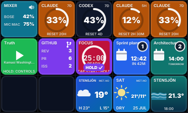</td>
    <td>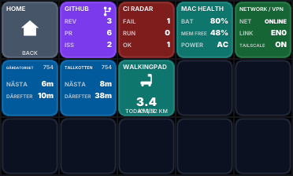</td>
  </tr>
  <tr>
    <th>Current Application</th>
    <th>Mixer</th>
  </tr>
  <tr>
    <td>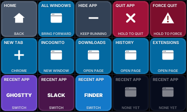</td>
    <td>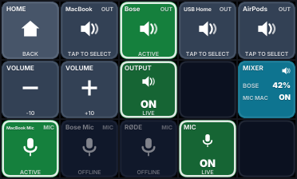</td>
  </tr>
  <tr>
    <th>GitHub</th>
    <th>Spotify</th>
  </tr>
  <tr>
    <td>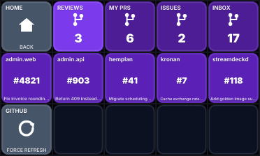</td>
    <td>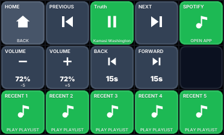</td>
  </tr>
  <tr>
    <th>Media</th>
    <th>Weather</th>
  </tr>
  <tr>
    <td>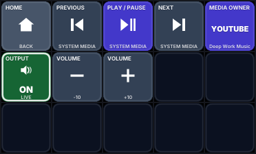</td>
    <td>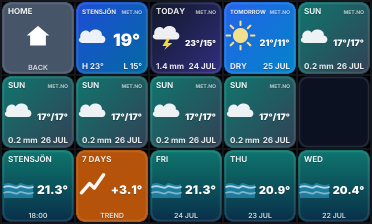</td>
  </tr>
  <tr>
    <th>Wispr Flow</th>
    <th>Stensjön</th>
  </tr>
  <tr>
    <td>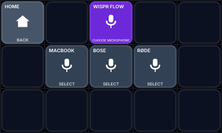</td>
    <td>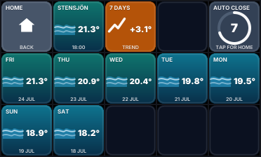</td>
  </tr>
  <tr>
    <th>Pomodoro</th>
    <th>WalkingPad controls</th>
  </tr>
  <tr>
    <td>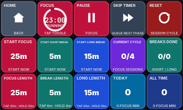</td>
    <td>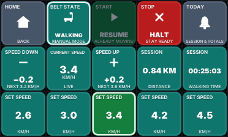</td>
  </tr>
  <tr>
    <th>WalkingPad statistics</th>
    <th></th>
  </tr>
  <tr>
    <td>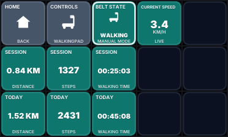</td>
    <td></td>
  </tr>
</table>

## Install

```sh
./scripts/install.sh              # build, install, load the LaunchAgent
./scripts/install.sh --no-agent   # binaries only, start it yourself
```

The installer builds release binaries, replaces them atomically, copies the
configuration template only if no configuration exists, validates the generated
LaunchAgent with `plutil`, and rolls the binaries back if the new build does not
become healthy within twenty seconds.

Installed files:

```text
~/Library/Application Support/streamdeckd/bin/{streamdeckd,streamdeckctl,streamdeck-alert}
~/Library/Application Support/streamdeckd/config.toml
~/Library/Application Support/streamdeckd/state.json
~/Library/Application Support/streamdeckd/streamdeckd.sock   (0600)
~/Library/LaunchAgents/io.github.jimmystridh.streamdeckd.plist
~/Library/Logs/streamdeckd/
```

The daemon will not start while another application owns the device. Quit Elgato
Stream Deck or OpenDeck first; `streamdeckd` never kills them for you.
If the deck is unplugged, the daemon stays alive and checks once per second until
the configured serial returns, then restores brightness and repaints all 15 keys.

WalkingPad support uses `walkingpad` 0.2.0. The daemon holds the crate's shared
device-store command lock for its lifetime, opens the saved device identifier
before scanning, maintains one BLE connection, and retries disconnects with
bounded exponential backoff. This intentionally prevents the WalkingPad CLI and
the daemon from sending belt commands concurrently. Telemetry is polled roughly
every 900 ms; controls disable as soon as the connection or status is not fresh.

Daily WalkingPad totals persist integer hundredths of a kilometre, steps, elapsed
seconds, and the last observed run counters. Only positive deltas between
continuous samples are counted; reconnects, process restarts, counter resets,
and local-midnight rollover establish a conservative new baseline. Consequently,
walking completed entirely while the daemon was offline cannot be recovered,
and a crash can lose at most the unflushed aggregation window (normally 30
seconds). Clean shutdown writes the current totals immediately. Start, halt,
mode, and speed are independent protocol operations; the daemon never changes
mode or speed as a hidden side effect of Start or Stop.

Wispr control uses the app's own `start-hands-free`, `stop-hands-free`, and
`switch-mic` deep links, so it does not require Accessibility access. Microphone
names in `[wispr.microphones]` are matched as case-insensitive prefixes by Wispr
Flow.

When the Mac locks, streamdeckd keeps ownership of the device and replaces the
current page with a native 15-key screensaver at 20 FPS. Each new lock session
selects the next scene—aurora, Matrix-style code rain, then a warp-speed
starfield—and keeps it until the Mac unlocks. Unlocking restores the page
that was visible before the lock. Session state is checked directly through
Core Graphics once per second while unlocked; Elgato and OpenDeck are never
started.

## Migrating from the Elgato plugin

```sh
./scripts/import-elgato-state.sh --dry-run   # show what would be imported
./scripts/import-elgato-state.sh             # write streamdeckd/state.json
```

This reads the plugin's global settings read-only, keeps a timestamped copy of
what it read, and writes only `streamdeckd/state.json`. It refuses to overwrite
an existing state file. Your Elgato profile is never modified.

## Control

```sh
streamdeckctl status                 # uptime, memory, page, counters, integration health
streamdeckctl status --json          # the same as a JSON payload
streamdeckctl devices                # connected decks and who owns them
streamdeckctl page home
streamdeckctl press 2,3
streamdeckctl hold 2,3 --milliseconds 700
streamdeckctl pomodoro acknowledge
streamdeckctl pomodoro start focus
streamdeckctl refresh github
streamdeckctl reload                 # transactional: invalid config changes nothing
streamdeckctl render-preview --page home --output /tmp/home.png
streamdeckctl doctor
streamdeckctl log-level debug
streamdeckctl stop
```

The socket is a closed protocol: every command is an enum variant. There is no
way to pass a command string, and nothing reaches a shell.

## Development

The default development target is a PNG, not the hardware, so you never have to
fight the Elgato app for the device:

```sh
cargo run -p streamdeckd -- --preview /tmp/deck.png --foreground
```

```sh
cargo test --workspace                                  # everything
cargo test -p streamdeck-core                           # domain rules, no I/O
UPDATE_GOLDEN=1 cargo test -p streamdeck-render         # rewrite the golden images
cargo clippy --workspace --all-targets -- -D warnings
cargo fmt --check
cargo audit
```

Golden images live in `tests/golden/`. A change there shows up as an image diff
and is expected to be reviewed, not rubber-stamped.

For a hardware session:

```sh
osascript -e 'quit app "Elgato Stream Deck"'
cargo run --release -p streamdeckd -- --foreground
./scripts/hardware-acceptance.sh
```

## Architecture

```text
crates/streamdeck-core     domain model: config, state, pomodoro, pages, parsers
crates/streamdeck-render   tiny-skia renderer, embedded fonts, project-owned icons
crates/streamdeck-macos    audio, system media, Spotify, Wispr, notifications, Meet, credentials
crates/streamdeckd         device I/O, services, WalkingPad controller, coordinator, control socket
crates/streamdeckctl       the CLI
crates/streamdeck-alert    the AppKit completion alert
```

`streamdeck-core` depends on no HID library, no macOS framework, and no HTTP
client, so every layout rule, timer transition, and payload parser is tested
without hardware or network access.

Three device implementations sit behind one `DeckDevice` trait: the real HID
device, a recording device for tests, and a preview device that writes a composed
PNG.

One deadline queue serves every timed behaviour — Pomodoro completion, visible
countdowns, long-press arming, panel dismissal, integration refresh, retry
backoff, alert repetition, WalkingPad persistence and midnight rollover — so the
process sleeps when nothing is due. Integration refresh is visibility-gated:
nothing polls for a key nobody can see. WalkingPad status polling is isolated in
its controller task because safety telemetry and command preemption must continue
even when its page is hidden; unchanged tile views are discarded before native
rasterization or USB writes.

## Secrets

Tokens are never written to configuration, state, or a log.

- GitHub uses the authenticated `gh` CLI.
- CI Radar reuses the authenticated `gh` CLI and retains only the latest run per
  configured repository.
- Google Calendar uses the authenticated `gog` CLI.
- Västtrafik departures use the short-lived anonymous token issued by
  `vasttrafik.se`; it is cached in memory and never persisted or logged.
- Claude usage reads the existing Claude Code Keychain entry, then its credential
  file.
- Codex usage reads `~/.codex/auth.json`.

Bearer tokens are held in a `Secret` wrapper whose `Debug` and `Display` print
`<redacted>`, so an accidental interpolation cannot leak one. Meeting URLs are
validated against `meet.google.com` before being handed to the system, and
artwork is only fetched from Spotify's own image hosts.

### Claude credentials

Background usage refreshes never request interactive Keychain access. The daemon
reuses a credential in memory for 30 minutes, checks
`~/.claude/.credentials.json`, then queries the Claude Code Keychain entry with
authentication UI explicitly disabled. If an existing entry cannot be read
silently, it is left alone for six hours rather than repeatedly asking macOS.

Run `claude` when the tile reports that its credential is missing or expired.

## Rolling back to Elgato

```sh
streamdeckctl stop
launchctl bootout gui/$UID ~/Library/LaunchAgents/io.github.jimmystridh.streamdeckd.plist
open -a "Elgato Stream Deck"
```

Nothing needs to be regenerated: the Elgato profile is untouched throughout.

## Licensing

`streamdeckd` is MIT licensed. It is a clean implementation and contains no
OpenDeck (GPL-3.0) code and no Elgato or Spotify plugin artwork.

Third-party assets are inventoried in [`assets/ASSETS.md`](assets/ASSETS.md).
Both embedded fonts are SIL Open Font License 1.1; every icon is authored in
`crates/streamdeck-render/src/icons.rs` as vector paths.

`cargo audit` reports no vulnerabilities. It does flag `ttf-parser` as
unmaintained (RUSTSEC-2026-0192); it is used only to read glyph outlines out of
the two fonts embedded at compile time, so it never parses untrusted input.
